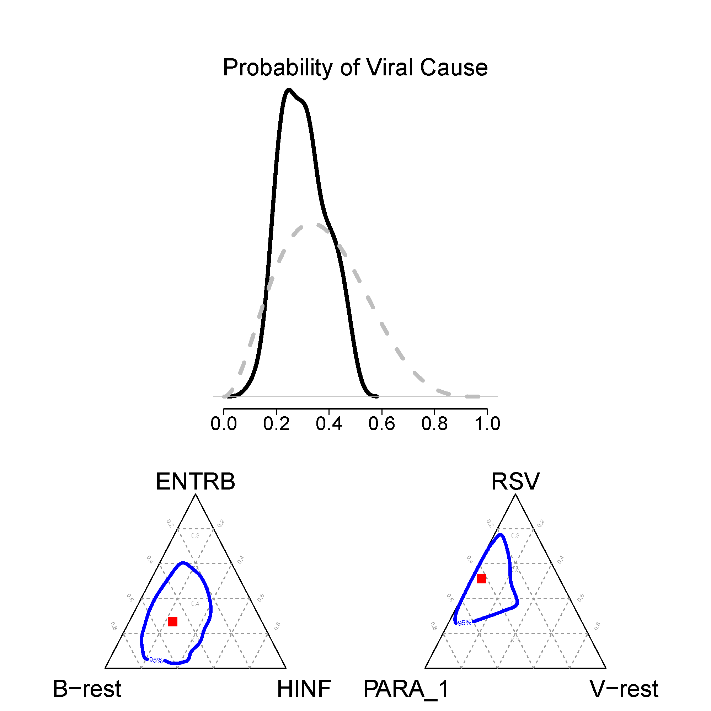

---
author:
  - name: Zhenke Wu
    affiliation: Johns Hopkins University
    address: >
      Department of Biostatistics
      Baltimore, Maryland 21205, U.S.A.
    email: zhwu@jhu.edu
    url: zhenkewu.com
  - name: Scott L. Zeger
    affiliation: Johns Hopkins University
    address: >
      Department of Biostatistics
      Baltimore, Maryland 21205, U.S.A.
    email: sz@jhu.edu
title:
  formatted: "\\pkg{baker}: Bayesian Analysis Kit for Etiology Research"
  # If you use tex in the formatted title, also supply version without
  plain:     "A Capitalized Title: Something about a Package foo"
  # For running headers, if needed
  short:     "\\pkg{baker}: An R package for Bayesian Analysis of Etiology"
abstract: >
  Clinicians are routinely inferring the differential causes of patients' diseases, also known as disease
  etiology, from a set of clinical or laboratory measurements indicative of the unobserved disease status. 
  However, such diagnoses are usually based on judgement and experience of individual doctors. As the
  measurements become complex
  in diagnostic evidence and large in volume, doctors would benefit from principled methods to
  integrate and extract signals from various predictive measurements, to compare the effectiveness
  of available treatment
  alternatives and to optimize ensuing treatment algorithms. In this article, we describe a methodological
  framework, known as
  the "learning health community" for
  considering general problems involving latent disease status and treatment effect evaluations. We 
  illustrate the framework with a hierarchical Bayesian model to infer disease etiology for multivariate
  binary data using a new R package `baker`. The package builds in functionalists for
  data cleaning, exploratory data analyses, model specification, model estimation, visualization and model
  diagnostics and comparisons, catalyzing vital effective communications between analysts and
  practitioner clinicians.
  `baker` has implemented models for dependent measurements given disease status, regression
  analyses of etiology, multiple imperfect measurements, different priors for true positive rates among
  cases with differential measurement characteristics, and multiple-pathogen etiology. The complete workflow
  and usage of the package are illustrated by both simulated and actual data from the motivating Pneumonia
  Etiology Research for Child Health (PERCH) study. 
keywords:
  # at least one keyword must be supplied
  formatted: [Bayesian hierarchical models, latent variable models, learning health community, measurement error, Markov chain Monte Carlo, individualized health, "\\proglang{R}", visualization, "\\proglang{WinBUGS}"]
  plain:     [keywords, not capitalized, Java]
preamble: >
  \usepackage{amsmath}
output: rticles::jss_article
csl: biomed-central.csl
---

``` {r,warning=FALSE, echo=FALSE,message=FALSE, commment=NA}
rm(list=ls())

library(knitr)
# start with clean bib
library(knitcitations)
cleanbib()
library(bibtex)
biblio <- read.bib("nplcm-reg.bib")
cite_options(hyperlink="to.doc",max.names=3,style="html")
```

```{r global_options, include=FALSE}
knitr::opts_chunk$set(fig.width=12, fig.height=8, fig.path='figures/',
                      echo=FALSE, warning=FALSE, message=FALSE)
```

# Introduction

We describe and illustrate a statistical framework for individualized health through a case study
of estimating disease childhood pneumonia etiology `r citep(biblio["Levine2012"])`.

# Models

## Measurement Models

We first discuss the partially-latent class models (pLCM) `r citet(biblio["wu2015plcm"])` with conditional independence assumptions. For a list of latent status (etiologic causes in PERCH), we have multiple measurements that are collected to infer the distribution of latent status for the diseased population and
latent status for individual subjects.The measurements are generally of two levels of quality:

1. Bronze-Standard (BrS) data that are available for both cases and controls but with imperfect sensitivity or specificity; Each measurement is a multivariate binary vector.
2. Silver-Standard (SS) data that are only available among cases. It has perfect specificity but imperfect sensitivity; Each measurement is a multivariate binary vector.

To allow multiple measurements to jointly inform latent status, we use a template for each measurement pair of (specimen, test) in PERCH, e.g., nasal-pharyngeal (NP) swab specimens tested by PCR technology) to indicate how we connect or "plug" measurements to latent status. 

The following are example templates for cases from 4 pairs of (specimen, test): NP PCR, Whole Blood (WB) PCR, NP Culture (CX) and Blood (B) Culture. Data obtained from the first three are BrS data and the last one is SS data. One feature of such representation is the measurements are connected by shared latent status, i.e., every row of each template table represents a category of latent status that can cause a pneumonia case. There are many possible extensions of this framework. For example, if a measurement exists to inform all bacterial latent status, then bacterial latent status rows will all be ones for that measurement's template. If more than one sub-populations are concerned, we may have separate templates, one for each stratum defined by covariates. Technically, 1s indicate that we need to use
true positive rates to describe the observed measurement on a pathogen for cases caused
by the latent status belonging to that row; 0s indicate that we need to use false positive rates
estimated from control population, whose templates for these measurements have all
zero entries.

```{r, echo=FALSE}

rm(list=ls())

#
# install and load requisite packages:
#
library(lubridate)
library(R2WinBUGS)
library(gplots)
library(binom)
library(coda)
library(ks) # for plot group etiologies posteriors.
library(robCompositions)

library(baker)

#
# 1.Clean Data:
#

newALLSITES             <- c("01KEN","02GAM","03MAL","04ZAM","05SAF","06THA","07BAN")
current_study_site      <- 2
sitename                <- newALLSITES[current_study_site]


# specify cause list:
cause_list <- c("HINF","PNEUVT13","PNEUNOVT13","PARA1","RHINO","RSV","ENTRB","TB","HINF+RSV","ENTRB+TB")
#names(cause_list) <- 1:length(cause_list)
#print(cause_list)

# specify measurements:
patho_BrS_NPPCR      <- c("HINF","PNEU","PARA1","RHINO","RSV")
patho_BrS_WBPCR      <- c("PNEU")
patho_BrS_NPCX_VT13  <- c("PNEUVT13","PNEUNOVT13")
## patho_BrS_NPCX_VT10  <- c("PNEU_VT10","PNEU_NOVT10") # <---- only for Kenya

patho_SS_BCX         <- c("HINF","PNEUVT13","PNEUNOVT13","ENTRB","TB")

# bronze-standard measurements:
BrS_object_1 <- make_meas_object(patho_BrS_NPPCR,"NP","PCR","BrS",cause_list)
BrS_object_2 <- make_meas_object(patho_BrS_WBPCR,"WB","PCR","BrS",cause_list)
BrS_object_3 <- make_meas_object(patho_BrS_NPCX_VT13,"NP","CX","BrS",cause_list)
# silver-standard measurements:
SS_object_1  <- make_meas_object(patho_SS_BCX,"B","CX","SS",cause_list)

library(knitr)
kable(as.matrix(BrS_object_1$template),caption = BrS_object_1$nm_spec_test, format = "latex")
kable(as.matrix(BrS_object_2$template),caption = BrS_object_2$nm_spec_test,format = "latex")
kable(as.matrix(BrS_object_3$template),caption = BrS_object_3$nm_spec_test,format = "latex")
kable(as.matrix(SS_object_1$template),caption = SS_object_1$nm_spec_test,format = "latex")
```


These templates describe for every dimension of a measurement (every column) the positive rates. To describe the joint probability of a vector of measurements (all columns), conditional independence model assumes that the measurements are not informative of one another given the knowledge of a case's disease status (i.e., which row a case belongs). 

## Priors

There are three sets of priors used in the model. 

For conditional independence model (pLCM):

> * True positive rate ($\mathbf{\Theta}$)
      + Bronze-standard (BrS) data; set by function `set_prior_tpr_BrS()`
      + Silver-standard (SS) data; `set_prior_tpr_SS()`
  * False positive rate ($\mathbf{\Psi}$)
      + Bronze-standard (BrS) data; non-informative priors `beta(1,1)`
  * Etiology pie ($\mathbf{\pi}$); set by function `overall_uniform()`

## Posterior Computing

We use the open-source statistical software R for data preprocessing, operations and
visualization. Another freely available Bayesian inference software, WinBUGS is used
to conduct posterior inference of all unknown parameters in the model. We use the
R package `R2WinBUGS` to connect R and WinBUGS for streamlined analyses. The results
will be generated and stored in a specified directory, which contains necessary information (e.g.,
posterior samples of unknown parameters, data, priors, likelihood specifications) for 
posterior analyses included in the `baker` package. 

# Software Components

There are six functional components altogether forming a analysis pipeline:

1. Clean/Prepare data
2. Exploratory data analysis (EDA)
3. Specify model
4. Fit model
5. Check model
6. Visualize results

We illustrate the workflow by the following conceptual figure:


In the following, we collect variable and function definitions using terms that are motivated by PERCH study to provide an easy and scientifically
grounded interface for analysts. We will convert them to generic names in future versions of `baker`, because the model is a general discrete state model. We put relevant file structures in shaded paragraphs.


Raw Data
---

### PERCH Data

We start by describing ingredients in PERCH raw data. In the data table,
the rows are for subjects, and columns stores information on case-control status, lab measurements, as well as other epidemiological or demographic covariates such as age, HIV status, enrollment date, etc.

The software `baker` is designed to infer latent variables (unobserved lung infections in PERCH) from the complex lab measurements. The lab measurements are named as `[PATHOGEN NAME]_[SPECIMEN NAME][ASSAY NAME]`. For example, the column `PNEU_NPPCR` represents the polymerase chain reaction (PCR) measurements for the bacteria *Streptococcus pneumoniae* (PNEU) using specimen from nasal-pharyngeal (NP) swabs. The results are coded as pathogen presence (1) or absence (0).

We also have taxonomy information about the studied pathogens that tells us which ones are bacteria, viruses, or sub-serotypes nested within a species (e.g., PNEU has many serotypes). 

Clean Data
---
We first preprocess the raw PERCH data into a form that is analyzable
by `baker`. 

### PERCH Data
We collect lab measurements, case-control status and other covariates into
`data_nplcm`:

1. `Mobs`: A list of measurements. The elements of the list should include MBS, MSS, and MGS. If any of the component is not available, please specify it as, e.g., MGS=NULL (effectively deleting MGS from Mobs).
    + `MBS`: a list of data frames of bronze-standard (BrS) measurements. Each element of the list
    has its name being the (specimen, test) pair. In each element (a data frame), rows are subjects, columns are pathogens with column names being pathogens. They have imperfect sensitivity/specificity (e.g. nasal-pharyngeal PCR).
    + `MSS`: a list of data frames of silver-standard (SS) measurements. Rows are subjects, columns are pathogens measured in specimen (e.g. blood culture). These measurements have perfect specificity but imperfect sensitivity.
    + `MGS`: a list of data frames of gold-standard (GS) measurements. Rows are subject, columns are pathogen measurements. These measurements have perfect sensitivity and specificity.
2. `Y`: Vector of disease status: 1 for case, 0 for control.
3. `X`: A data frame of covariates for regression modeling. It contains raw covariate data specified
by `X_strat` and `X_extra`. It is not design matrix for regression models.

This is the structure of the most basic data type for the model. There are functions in `baker` that would require information that is not data, e.g., the template to refer each measurement to the category of latent status that is useful in model fitting. 

This structure is automatically generated as outputs from both functions: `clean_perch_data()` and `simuate_nplcm()`.

> * `clean_perch_data()`
      + `clean_combine_subsites()`
      + `extract_data_raw()`
      + `make_meas_object()`
      + `show_individual()`

### Simulated Data

We will use simulated data (cleaned by definition) to demonstrate functions for visualization, analysis, data summary as well as to facilitate comparisons with other methods, such as population attributable fractions. 

To simulate data sets in the framework of npLCM, we need to specify the following parameters: population etiology pie $\mathbf{\pi}$, true positive rates $\mathbf{\Theta}$, false positive rates $\mathbf{\Psi}$. 

>* `simulate_nplcm()` for simulating measurement data without knowing actual latent status of observations;
    + `simulate_latent()` samples latent status for each subject;
    + `simulate_brs()` samples bronze-standard measurements based on sampled latent status;
    + we can add extra measurements by writing functions similar to `simulate_ss()`, say to generate silver-standard measurements.

    
Exploratory Data Analysis (EDA)
---
Model-free display of raw data information.

> * `plot_logORmat()`: plot pairwise log odds ratios along with
standardized estimate and t-statistic for cases and controls.

Specify Model
---

The `baker` package can fit multiple models with various specifications of measurement
likelihood and prior. The main workhorse of this package is a high-level `nplcm()` which can interpret the model specifications and call low-level model fitting functions for the  analyses introduced in the next section.

We allow the user to specify which model to fit along with prior information through
`model_options` which contains `likelihood`, `use_measurements` and `prior`. 

> 1. **`likelihood`**
    + `cause_list` The vector of latent status;
    + `k_subclass` The number of nested subclasses. 1 for conditional independence, >1 for conditional dependence;
    + `Eti_formula` formula for etiology regressions. You can use dm_Rdate_Eti to specify the design matrix for R format enrollment date; it will produce natural cubic splines for every date. Specify ~0 if no regression is intended.
    + `FPR_formula` formula for false positive rates (FPR) regressions; see formula. You can use dm_Rdate_FPR to specify part of the design matrix for R format enrollment date; it will produce thin-plate regression spline basis for every date (if effect="random" and num_knots_FPR is specified to a positive integer, e.g., 10.). If effect="fixed", dm_Rdate_FPR will just specify a design matrix with appropirately standardized dates. Specify ~0 if no regression is intended.
2. **`use_measurements`** 
    + a vector of characters strings; can be any singleton or combinaitons of "BrS", "SS", "GS".
3. **`prior`**
    + `Eti_prior` Description of etiology prior (e.g., one can use `overall_uniform()` to specify hyperpriors for latent status distribution);
    + `TPR_prior` Description of priors for the true positive rates for measurements. Check illustrative examples for more details.
    
These parameters are first used by `assign_model()` to interpret the model to fit. It will compare the actual data provided against the specification. When it detects the data are not conformable to feed in the user-specified model, `assign_model()` will instruct how to re-prepare data (assuming correct model specification).

Fit Model
---

The fitting function `nplcm()` takes in the following three arguments:

> * `nplcm()`
    + `data_nplcm`
    + `model_options`
    + `mcmc_options`

The function `nplcm()` can fit the following models:

* No formal regression analysis
    + measurement conditional independence model: done.
    + measurement conditional *dependence* model: done.
* Regression analysis
    + measurement conditional independence model
    + measurement conditional *dependence* model

Because we currently use WinBUGS for Bayesian inference of the models, we need to provide `.bug` files with model likelihood and prior. The package `baker` can interpret the specified models and write them in `.bug` files. For example, `baker` uses
`write_model_NoReg()` to write .bug file for models without regression and conditional independence model, accommodating multiple bronze-standard (any standard) data and covariate-stratified (e.g., antibiotic use) TPRs for silver-standard data. 

Check Model
---

Posterior predictive checking:
* `check_common_pattern()` and `check_common_pattern_two_folders()`
* `check_pairwise_logOR()` and `check_pairwise_logOR_two_folders()`


Visualize Results
---

`baker` provides powerful tools for visualizing Bayesian inference results of the distribution of latent status structure for the population and an individual. The
figures are designed to facilitate easier communications between analysts
and domain experts (e.g., epidemiologists and clinicians in PERCH study). The plotting
functions assume a model has been fitted with posterior samples and model settings stored at a folder. The visualization functions and figures produced from them are listed below.


* `plot_group_etiology()`: density function of two-group fraction, for example, the probability of viral etiology. The figure also includes cascaded ternary diagrams down the taxonomy, e.g., the fractions of the most, second-most frequent viruses and other viruses.
    
    

* `plot_selected_etiology()`: triangle plot for selected three;
* `plot_panels()`: a multi-panel figure that puts data, prior and posterior together. In our experience, it is most effective for research on understanding information for disease etiology and measurement characteristics as well as the synergy among all types of available measurement data.

```{r, echo=FALSE, results = "hide",fig.width=20, fig.height=10}
result_folder <- "C://2015_08_07_02GAM"
plot_panels(result_folder)
```

* individual prediction


* regression visualization

# Examples

## Simulated Examples

## PERCH Study

# Discussion

# Reference

```{r  results="asis",warning=FALSE, echo=FALSE,message=FALSE}
bibliography()
```
